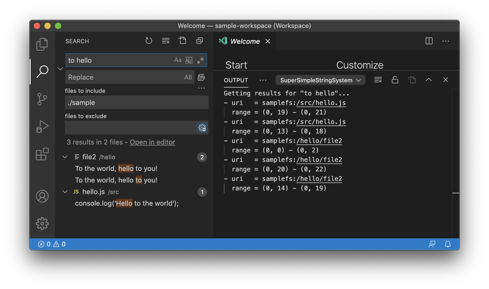

# sample-fs-and-search-repro README

This extension provides an extremely basic filesystem of text-only files and directories. This is to illustrate the shortcomings in the `TextSearchProvider` functionality.

For searching, this filesystem searches on whole words, where a file matches if it contains at least an instance of each word in the query. This is an extremely basic approximation of how web search engines or code search engines behave. Here, the expectation is that each word that was matched should be highlighted.

For example, say we have two files with their respective content:
- file1: I say Hello world!
- file2: To the world, hello to you!

Here are some sample search queries, and what the results should be. The highlighted portions are in brackets:
- "hello"
  - file1:
    - I say [Hello] world!
  - file2:
    - To the world, [hello] to you!
- "hello world"
  - file1:
    - I say [Hello] world!
    - I say Hello [world]!
  - file2:
    - To the [world], hello to you!
    - To the world, [hello] to you!
- "hello wor"
  - no matches, because neither file has "wor" by itself
- "hello to"
  - file2:
    - [To] the world, hello to you!
    - To the [world], hello to you!
    - To the world, hello [to] you!
  - file1 doesn't match because it doesn't have "to"

## Steps to reproduce:
1. Launch VS Code (or Insiders) with the `--enable-proposed-api APLmath.sample-fs-and-search-repro`
1. Install this extension by .vsix
1. Open the `sample-workspace.code-workspace` workspace
1. In the output console, select "SuperSimpleStringSystemProvider" to see the results that are being reported for each search
1. Try doing a search for "to hello"

Notice that in the output console, there are supposed to be 5 results, but only 3 are shown in the search results UI:

